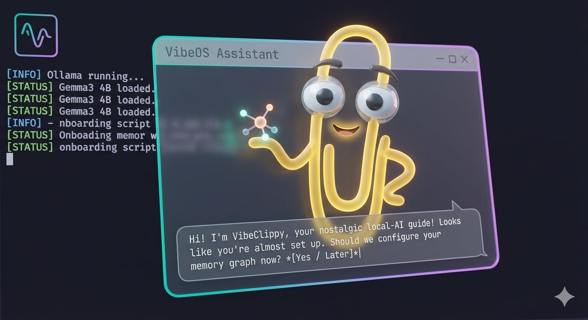

# VibeOS

**AI-native development environment for Linux. Free. Open source. Fun.**



*Vibbey, the VibeOS onboarding assistant, in the Neon Grid UI. Local Ollama + Groq fallback, real 3D Clippy-lineage model, zero telemetry.*

VibeOS turns a fresh Linux machine into a fully configured Claude Code workspace — with local AI models, persistent memory, tool-aware onboarding, and just the MCP servers you actually need. **Vibbey**, your nostalgic desktop assistant, lives in the bottom-right corner of your screen and walks you through setup.

## Choose your path

### 🐧 Path A — "I already have Linux"

One command on your existing Ubuntu, Pop!\_OS, Debian, Mint, or Kubuntu install:

```bash
curl -sSL https://raw.githubusercontent.com/Matswm86/vibeos/main/install.sh | bash
```

Takes ~10 minutes (apt + npm + Ollama model pull). After it finishes, Vibbey pops up as a floating desktop widget and walks you through first-boot setup. Vibbey runs on Groq cloud (smart, fast) with local Ollama fallback (private, offline) and greets you with:

> *"Looks like you're about to Vibe hard. Would you like to continue? ;)"*

**Status**: shipped, v0.3.2+. Stable.

### 💿 Path B — "Start from scratch"

Download `vibeos-0.4.0.iso`, flash it to a USB with [balenaEtcher](https://www.balena.io/etcher/), boot your machine from the USB, and land in a fully-themed VibeOS desktop. Zero terminal steps. Ideal for users who have never installed Linux and want the "just works" experience.

What you get:

- 🎨 Full Neon Grid rebrand — custom GRUB menu, Plymouth splash, SDDM login, KDE Plasma theme, fonts, wallpapers
- 🤖 Vibbey anchored to the bottom-right of your desktop on first login (layer-shell, no window chrome)
- 🧠 Everything from Path A preinstalled: Claude Code, Ollama, Docker, GitHub CLI, Node.js, Python, Git
- 🔑 Hybrid Groq + Ollama with 300 free bootstrap messages, then bring-your-own-key

**Status**: actively building. Stage 4 tracked in [`plans/vibeos-stage4.md`](https://github.com/Matswm86/MWM-AI/blob/main/plans/vibeos-stage4.md). Base distro: Kubuntu 22.04 LTS + KDE Plasma. Hosted at `iso.mwmai.no` once shipped.

---

## What gets installed

| Component | Version | Purpose |
|-----------|---------|---------|
| Python | 3.10+ (distro default) | MCP servers, Vibbey, tooling |
| Node.js | 22 LTS | Claude Code, npm MCPs |
| Docker | latest | Optional local services |
| Ollama | latest | Local AI models (Vibbey + your own) |
| Claude Code | latest | Primary AI assistant |
| GitHub CLI | latest | Repository operations |
| WebKit2 + GTK | system | Vibbey desktop window (falls back to system browser) |

**Default MCP stack** — minimal by design, zero infrastructure required:

| MCP Server | Backend | Purpose |
|-----------|---------|---------|
| `memory` | SQLite | Persistent knowledge graph at `~/.claude-memory` |
| `github` | API | Repository operations (needs `GITHUB_TOKEN`) |

> **Note**: `filesystem` MCP was removed in v0.3 — Claude Code's native `Read` / `Write` / `Edit` / `Glob` / `Grep` tools cover the same ground without the tool-name duplication. Add it back manually if you prefer the MCP flow.

---

## Hardware requirements

**Minimum** (VibeOS installs and runs fully):
- CPU: 64-bit x86, 2018 or later, AVX2 support
- RAM: 8 GB
- Storage: 20 GB free
- GPU: not required
- Internet: required for Claude Code API

**Recommended** (comfortable daily use):
- RAM: 16 GB
- GPU: any discrete NVIDIA or AMD (for faster local models)
- Storage: 60 GB free

The onboarding model (Gemma3 4B) runs on CPU-only. Claude Code itself requires no local GPU — it runs on Anthropic's API.

---

## What VibeOS is (and will be)

**Path A today (v0.3.2+)** — an installer + configuration layer on top of any Debian/Ubuntu-family distro. Everything downloads at install time, so you always get the latest Claude Code and latest MCPs. Vibbey runs as a chrome-stripped webkit2gtk widget after the install finishes.

**Path B in active development (v0.4.0, Stage 4)** — a bootable `.iso` image based on **Kubuntu 22.04 LTS (KDE Plasma)** with a full VibeOS rebrand: custom GRUB, Plymouth boot splash, SDDM login theme, VibeOS-Neon Plasma theme + Aurorae window decorations + Kvantum for GTK apps, custom icons, cursors, fonts (Orbitron / JetBrains Mono / VT323), Tron-grid wallpapers, and Vibbey auto-launching on first login **as a true layer-shell desktop widget** (no window chrome, no Alt-Tab entry, anchored to the bottom-right corner).

Why Kubuntu + KDE and not GNOME or COSMIC? We tested. KDE's KWin is currently the only widely-deployed Linux compositor with **mature, rendered layer-shell support**, which is the Wayland protocol that lets Vibbey be a true desktop widget instead of a window. GNOME Mutter rejects layer-shell, and COSMIC (Pop!\_OS's new compositor) accepts the protocol but doesn't yet render GTK3 layer surfaces visually. Kubuntu gets us working integration today.

**Not bundling Claude Code.** It's proprietary Anthropic software. The installer downloads it directly from Anthropic, same as Chrome or VS Code installers.

---

## Meet Vibbey

Vibbey is VibeOS's onboarding character: nostalgic nod to Microsoft's old paperclip, self-aware, slightly cheeky, and actually useful this time. She knows your OS, install state, and her own roadmap — and she can run safe shell commands on your behalf with your confirmation.

**Brain** — Vibbey routes chats through three tiers, automatically falling back:

1. **Your own Groq key** (if you have one at `~/.vibeos/groq.key`) → unlimited smart mode on `llama-3.3-70b-versatile`
2. **VibeOS bootstrap proxy** (`~/.vibeos/groq.token`) → 300 free messages on the hosted proxy at `groq.mwmai.no`, so newbies get smart mode without signing up
3. **Local Ollama** (`gemma3:4b` default, auto-detects whatever you have pulled) → private, offline, no cost

**Knowledge** — at server startup she loads a static knowledge pack from `clippy/knowledge/` (identity, common commands, troubleshooting) straight into her system prompt, so she can answer "how do I open a terminal" or "how do I auth GitHub CLI" without searching the web.

**Memory** — persists across sessions in `~/.vibeos/vibbey-memory.json` (mode 0600). Stores user profile, chat history (last 50 exchanges), learned facts, and a cached install-state snapshot. Wipe it with `rm` any time.

**Tool use** — Vibbey can run ~15 allowlisted read-only commands (`claude --version`, `gh auth status`, `ollama list`, `docker info`, `free -h`, `nvidia-smi`, `cat /etc/os-release`, etc.) via `POST /api/run`. Every execution requires user confirmation in the chat bubble first. No writes, no sudo, no network calls outside Groq/Ollama.

**UI** — she lives in a floating webkit2gtk widget anchored to the bottom-right of your desktop via the Wayland layer-shell protocol (on KDE Plasma and other compositors that support it) or as a chrome-stripped toplevel on X11/XWayland. The 3D Clippy-lineage model renders via Three.js + GLTFLoader with neon magenta + cyan rim lighting and a gentle idle bob.

To run Vibbey manually from any shell:

```bash
python3 -m clippy              # full-chrome window (dev/debug)
python3 -m clippy.widget_mode  # chrome-stripped desktop widget (target)
```

(The `clippy` module contains Vibbey's launcher, server, Three.js scene, knowledge pack, memory store, tool-use allowlist, Groq proxy, and voice. The directory name is a nod to the lineage — the character is Vibbey.)

To skip Vibbey (for CI, Docker tests, or scripted installs):

```bash
VIBEOS_NO_ONBOARDING=1 ./install.sh
```

## After install

```bash
# Authenticate Claude Code
claude

# Authenticate GitHub
gh auth login

# Set GitHub token for MCP server
export GITHUB_TOKEN=ghp_...    # add to ~/.bashrc

# Start Claude Code in your project
cd ~/my-project
claude
```

Your `~/CLAUDE.md` tells Claude about your workspace. Edit it to describe your project and preferences.

---

## Power user tier (opt-in)

Add hosted vector + graph memory for cross-session persistence and semantic search:

```bash
# Optional: start local Qdrant + Neo4j via Docker
# (install.sh sets up Docker but doesn't start these by default)
docker run -p 6333:6333 qdrant/qdrant
```

Or use [VibeOS Managed MCP](https://github.com/Matswm86/vibeos) — hosted Qdrant, Neo4j, and mem0 endpoints you drop into your `settings.json`. No infrastructure to run.

---

## Roadmap

- [x] Stage 1: Generic installer
- [x] Stage 2: Vibbey — Ollama onboarding agent (guided first-boot experience)
- [x] Stage 2.5: Minimal MCP stack (filesystem removed in v0.3, auto-onboarding)
- [x] Stage 2.6: install.sh hardening (v0.3.1) — `/dev/tty` curl-pipe fallback, dual memory-location docs, `vibe` alias
- [x] **Stage 3: Vibbey Phase B** (v0.3.2) — real 3D Clippy-lineage model in a webkit2gtk desktop window, Three.js + GLTFLoader, local Ollama chat proxy, model auto-detect, python3 auto-reexec. "Clippy, but it actually works now."
- [x] **Stage 3.5: Vibbey brain upgrade** (2026-04-10) — Groq + Ollama hybrid routing (BYO key → bootstrap proxy → local fallback), static knowledge pack injected into system prompt, persistent memory at `~/.vibeos/vibbey-memory.json`, tool-use allowlist via `POST /api/run` with user confirmation, widget-mode chrome-stripped launcher. Vibbey now knows her OS, install state, and roadmap — and can execute safe commands.
- [ ] **Stage 4: Kubuntu-based VibeOS ISO + full OS rebrand** — bootable `.iso` based on Kubuntu 22.04 LTS (KDE Plasma), with custom GRUB, Plymouth, SDDM, VibeOS-Neon Plasma theme + Aurorae + Kvantum, icons, cursors, fonts, wallpapers, and Vibbey auto-launching as a layer-shell desktop widget on first login. Hosted at `iso.mwmai.no`. Plan: [`plans/vibeos-stage4.md`](https://github.com/Matswm86/MWM-AI/blob/main/plans/vibeos-stage4.md).

---

## Contributing

Issues and PRs welcome. The installer targets Ubuntu 22.04+ / Pop!\_OS 22.04+.

To test locally:
```bash
git clone https://github.com/Matswm86/vibeos
cd vibeos
chmod +x install.sh
./install.sh
```

---

## License

MIT — see [LICENSE](LICENSE).

### Third-party assets

- **`clippy.glb`** — "Rigged Microsoft Clippy/Clippit" by [Freedumbanimates](https://sketchfab.com/Freedumbanimates) on Sketchfab, used under the [Sketchfab Standard](https://sketchfab.com/licenses) license. Textures were stripped for size; Vibbey animates the rig via Three.js root-transform. Full attribution in [`clippy/ATTRIBUTION.md`](clippy/ATTRIBUTION.md).
- **Concept image** (`clippy/reference/concept.jpg`) — visual direction reference for Phase 1 / Stage 4; Mats Mjåtvedt, 2026-04.
